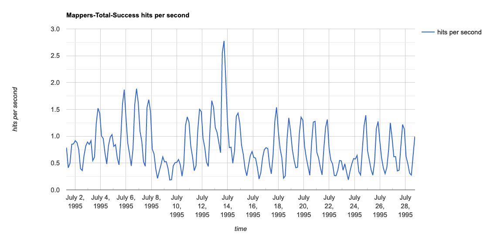

# LogRater


[](https://app.codacy.com/manual/peter.paul.bakker/lograter?utm_source=github.com&utm_medium=referral&utm_content=stokpop/lograter&utm_campaign=Badge_Grade_Dashboard)
[](https://www.codacy.com/manual/peter.paul.bakker/lograter?utm_source=github.com&utm_medium=referral&utm_content=stokpop/lograter&utm_campaign=Badge_Coverage)

LogRater analyses performance behaviour of your applications and services.

Feed logs from your web and application servers to generate performance reports.

LogRater can be run stand-alone from the command line, or can be included as jar in any Java project.

LogRater is sponsored by Rabobank.

# Quick start

You can download a pre-build jar here: https://github.com/stokpop/lograter/releases

with curl: 

    curl -O -L https://github.com/stokpop/lograter/releases/download/1.5.2/lograter-exec-1.5.2.jar

use java 11+ to run lograter:

    java -jar lograter-exec-1.5.2.jar

download an example dataset:

    curl -O -L ftp://ita.ee.lbl.gov/traces/NASA_access_log_Jul95.gz
  
process this file:

     java -jar lograter-exec-1.5.2.jar access -gt -single-mapper NASA_access_log_Jul95.gz  

(Note: there are some errors for some lines that contain invalid urls with unexpected quotes. These can be ignored.)
   
Check the reports/access-log-rater-charts.html (the `-gt` stands for "graph for tps"):



You can see clearly the week days and weekend days pattern and a busy day.
The busy day is probably because of some space shuttle events on that day.

Also notice there is no response times recorded in this access log.
If you have access log files that include response times, a lot more
performance information will be revealed.
    
### Commands

The available commands:

* `iis`         parse a IIS log file
* `access`      parse an access log file
* `pc`          parse a performance center results database
* `application` parse an (Java logback) application log file
* `latency`     parse a log file that contains latency/duration numbers, based on logback syntax
* `alloc`       parse WebSphere application server logs with large allocation 
* `gc`          parse WebSphere verbose garbage collection log files
* `accessToCsv` transform an access log to a csv file
* `jmeter`      parse jtl file from a jMeter run

### Basic options and command options

The order of the options on the command line is important. There are general options and command specific options.

    java -jar lograter-exec-1.5.2 [general options] [command] [command options] [input file(s)]

When you get errors that input files cannot be found, make sure the order of the general options is correct.

### Option file

For multiple command line options it is advised to use a file with options.

This also helps when defining a complex log pattern where you need to escape quotes on the command line.

Put all the options in a file, one option and one parameter per line, with no additional spaces.

For example, create a `latency.options` file like the following to parse log lines such as:

    2020-06-14T10:51:32.51-0700 [RTR/1]      OUT www.example.com - [14/06/2020:17:51:32.459 +0000] "GET /user/ HTTP/1.1" 200 0 103455 "-" "Mozilla/5.0 (Windows NT 6.1; WOW64) AppleWebKit/537.36 (KHTML, like Gecko) Chrome/36.0.1985.123 Safari/537.30" 192.0.2.132:46359 x_forwarded_for:"198.51.100.120" x_forwarded_proto:"http" vcap_request_id:9365d216-623a-45cb-6ef6-eba495c19fa8 response_time:0.059468637 app_id:79cc58aa-3737-43ae-ac71-39a2843b5178 x_b3_traceid:"39a2843b5178" x_b3_spanid:"39a2843b5179" x_b3_parentspanid:"-" b3:"%X{39a2843b5178-39a2843b5179}"

Based on: https://docs.cloudfoundry.org/devguide/deploy-apps/streaming-logs.html    
    
```
-r
my-report-{ts}
latency
-fffi
\[RTR/
--counter-fields
http-url,http-method,http-code
-session-duration
-sessionfield
x_b3_traceid
-clickpath
-latency-field
response_time
-latency-unit
seconds
-lp
%d{yyyy-MM-dd'T'HH:mm:ss.SSSZ} [RTR/%X{rtr-nr}]%X{whitespace}OUT %X{host} - [%X{timestamp}] "%X{http-method} %X{http-url} %X{http-version}" %X{http-code} %X{http-something} %X{http-bytes} "%X{unknown1}" "%X{http-referer}" %X{remote-ip}:%X{remote-port} x_forwarded_for:"%X{x_forwarded_for}" x_forwarded_proto:"%X{x_forwarded_proto}" vcap_request_id:%X{vcap_request_id} response_time:%X{response_time} app_id:%X{app_id} x_b3_traceid:"%X{x_b3_traceid}" x_b3_spanid:"%X{x_b3_spanid}" x_b3_parentspanid:"%X{x_b3_parentspanid}" b3:"%X{b3}"
# this is a comment, but you can also place a filename here
```

This will use a file feeder filter include (fffi) to only process lines that match the regexp "\[RTR/".
It will use the `url` field to create performance counters and click path.
The `x_b3_traceid` is used to determine click paths and session duration.
Response time (or latency) is parsed from the `response_time` field. The `response_time` field contains seconds.
Put reports in a directory called `my-report-{ts}`, where {ts} is replaced with current timestamp.

The counters are based on unique combinations of the `counter-fields`. The first of the counter-fields 
(in this example `http-url`) is mapped according to the mapper file, if a mapper file is present.


Now call LogRater as:

    java -jar lograter-exec-1.5.2.jar @latency.options cloud-foundry.log  

## Uses

### Incoming requests

Get logs from your production servers and find out which requests have the highest hits per second.
For each request see the average response time and the percentiles. 

For each type of request, see how many concurrent requests there are.

LogRater can scan following web or access logs:
* `apache`: apache web server access logs
* `nginx`: nginx access logs
* `iis`:  Microsoft IIS servers access logs
* `latency`: any log file that contains timestamp, url and latency

Latency is the 'all-purpose' parser, but it cannot use access log directives such as `%r`.
The `latency` command uses the first of the `--counter-fields` to apply line mappings to. 
Example: `-- counter-fields operation,status` the line mappings are applied to `operation`.

Use the log pattern to define your log line structure. LogRater needs at least:
 * a timestamp
 * the endpoint called (url for example) 
 * the duration of that call
 * optionally the http status code 

In apache access log these are defined by these directives: 
* `%t`
* `%r`
* `%d` (milliseconds) or `%D` (microseconds) or `%T` (seconds)
* `%s` 

You can directly copy the log pattern definition from the http.conf file. If the original log pattern is unknown 
or non-existent, you can create a log pattern yourself and make use of "placeholders" such as "`%{name}X`" for the parts that are not needed.
 
Take this line for example:

    2020-01-29T16:45:45.29+0100 [RTR/1] OUT afterburner-cpu.stokpop.nl - [2020-01-29T15:45:44.813+0000] "GET /delay?duration=200 HTTP/1.1" 200 0 85 "-" "curl/7.64.1" response_time:0.477786246 x_b3_parentspanid:"-" b3:"abc123"

To parse a line like this, you can use this log pattern:

    %{one}X - %{[yyyy-MM-dd'T'HH:mm:ss.SSSZ]}t "%r" %s %{two}X response_time:%T %{three}X

LogRater will use the literals to parse the line (first is "` - `" so all before that character sequence is "read" into `%{one}X`). 

Notice the second timestamp in the log line is actually being parsed. 

The `%r` is used to get the url (%r is actually the triplet <http command, url, and http version>).

The `%s` is for the http status code to detect errors.

And `%T` is for the response time in seconds.

Note that information in `%{one}X`, `%{two}X` and `%{three}X` is not used. 

The default pattern for `%t` is `[dd/MMM/yyyy:HH:mm:ss Z]`. This example uses an alternate, explicit time format.
     
Run as follows:

    java -jar lograter-exec-X.Y.Z.jar -o report-{ts}.html access -lp "%{one}X - %{[yyyy-MM-dd'T'HH:mm:ss.SSSZ]}t \"%r\" %c %{two}X response_time:%T %{three}X" -gh -gr -gp -gt -sd -fffi "GET" Afterburner-CPU.log

* `-fffi "GET"`: only lines that contain `GET` are included 
* `-gh -gr -gp -gt` create graphs: histogram, response times, percentiles, transactions per second (tps).

### Outgoing requests

If logs are available for outgoing requests, you can create performance analysis reports for these as well.
For example using the `latency` command.

### Compare production to test

If you run load tests on a performance test environment, compare the reports to the reports of production
to check if the load test covers the same requests and behaves the same in response times as production.

### Automate analysis 

For automatic tests also automate the analysis of the rest results. 

### Map names

Use mappers to map technical requests (urls) to human readable names. Use 
mappers to group urls that are the same actually the same request, but contain a unique id that 
needs filtering.

A mapper file looks like:

    ^/my/api/customer/.*$###customer request
    ^/my/api/app/(.*)$###app $1 request

Use the `-mf` options with a path to this mapper file.

The format is a regular expression, then three hashes, and the name to map to.

The second line contains a matching group `(.*)`, which is referred in the name by `$1`.
For more than one matching group use `$2`, etc.

The `^` matches the beginning of a url, the `$` matches the end of a url.

The customer line contains `.*` which matches anything after the slash till the end.
So `/my/api/customer/34234` and `/my/api/customer/55453` map to same name: `customer request`.

In this example an url with `/my/api/app/create` maps to `app create request` 
and `/my/api/app/delete` maps to `app delete request`.

### Failures

Some log parsers are failure aware and count the number of failures. For example, the access
logs use the http status code to count a log line as a success or a failure. 
Via the `-include-failed-hits-in-analysis` option you can have the failures included 
or excluded in the calculated values of the counters, such as min and max response times.

The `latency` report has options to define the fields for success or failure:
`-failure-field`, `-failure-field-type`, `failure-field-regexp`.

Failure field type can be `bool`, `http` or `regexp`. For instance, if you have a field called `message` and you want it to count as a failure when
it includes the word `error`, use the options:

    -failure-field message -failure-field-type regexp -failure-field-regexp error 

### Load test logs

LogRater can make similar analysis for both JMeter logs and Performance Center result zip files.

### Application logs

For logback style Java application logging, LogRater can parse application logs to find
common errors and stacktraces. It also gives an indication of 'logging' pressure under load:
how many lines per minute are logged.

### CPU

When you have sar files from Linux servers, LogRater can determine the average CPU usage
and show CPU graphs. For instance during a load test.

### Time period

For most LogRater analysis you can specify a start and end time to zoom into the period that is
of interest. For example, a very busy period on production, or a certain period of a load test.

### Create graphs

Show graphs per request type to easily identify issues or unexpected behaviour.
The following graphs are available: 

* `-gr`: response times over time 
* `-gt`: load over time in transactions per second (tps) 
* `-gh`: histogram of response times 
* `-gr`: percentiles of response times 

Both available as png and as interactive javascript/html graphs with popups. 

### Sessions 

When session identifiers are available in the logs, LogRater can determine session duration times
and also common paths that users follow through the application.

### Extend LogRater

For custom logs you can easily extend LogRater to parse these logs as well and
produce similar reports and graphs.
  
#### Example run

To run from the command line, use the executable jar which contains all references.
For instance to parse apache access logs:

    java -jar lograter-exec.jar access access.log

To see all options:

    java -jar lograter-exec.jar -h
 
### Dependency

To use LogRater from Maven or Gradle: find the latest LogRater jar in [Maven Central search](https://search.maven.org/search?q=lograter).

### LogRater command line options

    LogRater version: 1.5.2

    Usage: nl.stokpop.lograter.LogRater [options] [command] [command options]
      Options:
        -et, --endtime
          The end time of filter: yyyyMMddTHHmmss
        -o, --output.file
          Write to this file. If not set writes to std out. Use {ts} to include a 
          timestamp in your filename.
        -r, --report.dir
          The directory for the reports (an html file with graphs in this 
          release). Use {ts} to include a timestamp in your directory. Defaults to 
          reports in current dir.
          Default: reports
        -st, --starttime
          The start time of filter: yyyyMMddTHHmmss
        -base-unit
          What base unit to use in reports. Choose from: milliseconds, 
          microseconds. Default is milliseconds.
          Default: milliseconds
          Possible Values: [microseconds, milliseconds]
        -clear-db
          Clear the database.
          Default: false
        -debug
          Print stacktraces with errors.
          Default: false
        -runid
          A run id to identify a test run with a report. Is displayed in reports.
          Default: 0b699f70-17f1-47ce-b336-5913791656a8
        -storage
          The type of storage to use. Options: mem (in memory, default), 
          externalsort or database (in sqlite database)
          Default: Memory
          Possible Values: [Memory, Database, ExternalSort]
        -storage.dir
          Where to store files for externalsort or database (in sqlite database). 
          Defaults to working directory.
          Default: .
        -use-db
          Only use database input, skip file parsing.
          Default: false

### Help `latency` command:

    Usage: latency [options] <List of files to parse, or a file prefix to 
          automatically load a set of files>
      Options:
        -ag, --aggregate-duration
          Aggregate graph values per time period in seconds. Aggregation kicks in 
          for graphs with more than 10000 points. The graph name will tell that 
          aggregation took place.
          Default: 5
        --clickpath-end-of-session-snippet
          Url's that contain this snippet are used as end of session marker 
          (default: logout)
          Default: logout
        --clickpath-report-step-duration
          Report the average duration between clickpath steps in millis.
          Default: false
        --clickpath-short-code-length
          Length of parts between slashes in clickpath urls, to shorten the path.
          Default: 3
        -cf, --counter-fields
          Counter fields to use for counting. Comma separated list of field names.
          Default: service,operation
        -fffe, --filefeederfilter-excludes
          Regular expression to use in the file feeder. Matches will NOT be 
          included. Matches are made on complete logline.
        -fffi, --filefeederfilter-includes
          Regular expression to use in the file feeder. Matches will be included. 
          Matches are made on complete logline.
        -gtps, --graph-with-tps
          Use true TPS per second in graphs instead of moving avg. (TPS per minute 
          is default)
          Default: false
        -gh, --graphs-histo
          Create histogram graphs
          Default: false
        -ghtml, --graphs-html
          Output html google charts style graphs
          Default: false
        -gp, --graphs-percentile
          Create percentile graphs
          Default: false
        -gr, --graphs-responsetimes
          Create response times graphs
          Default: false
        -gt, --graphs-tps
          Create TPS graphs
          Default: false
        -lp, --log-pattern
          The logback/httpd LogFormat pattern to use.
          Default: %d;%X{sessionId};%X{service};%X{operation};%X{latency}%n
        -mf, --mapper-file
          Mapper file to use. Also used in clickpath analysis.
        --max-unique-counters
          Maximum number of unique counters before an overflow counter is used 
          that combines all further counters (named OVERFLOW_COUNTER).
          Default: 512
        -conc, --report-concurrent-transactions
          Calculate and report concurrent calls based on log time and duration. 
          Adds a conc column in the report that shows the max concurrent requests 
          for that particular url or request mapper.
          Default: false
        -sd, --report-standard-dev
          Calculate and report standard deviation of durations.
          Default: false
        -tps, --report-transactions-per-second
          Calculate and report transactions per second (next to TPM).
          Default: false
        -clickpath
          Determine and report click paths (BETA). Set sessionfield for the 
          session id to use.
          Default: false
        -failure-aware
          Be failure aware if possible. Report on failed hits in each analysis 
          line. If not set the module defaults are used.
        -failure-field
          Field used for failure detection. Also specify the failure type. Default 
          is empty.
        -failure-field-regexp
          The regular expression to determine failures. If it matches, it is a 
          failure, otherwise success.
          Default: error
        -failure-field-type
          Type of the failure field: bool, http, regexp. Default is http.
          Default: http
          Possible Values: [http, bool, regexp]
        -graphs-histo-simulator
          If histo graphs are enabled, also merge a simulation of the histogram 
          based on stub delay generator.
          Default: false
        -include-failed-hits-in-analysis
          Include failed hits in analysis. When false the reported number of 
          failures and failure percentage are the same for each counter, but the 
          other calculated values such as min, max, tps, averaqe, percentiles will 
          not include failed hits. "Default behaviour can differ for different 
          modules. Most have true, performance center analysis has false.
        -latency-field
          Field used for latency. Also specify the latency unit!
          Default: latency
        -latency-unit
          Unit used for latency: seconds, milliseconds, microseconds, nanoseconds. 
          Default is milliseconds.
          Default: milliseconds
          Possible Values: [seconds, milliseconds, microseconds, nanoseconds]
        -report-percentiles
          List of percentiles to report. These are comma separated double values, 
          for example: 99,99.9,99.995
          Default: [99.0]
        -report-stub-delays
          Add stub delay column settings in report.
          Default: false
        -session-duration
          Determine the average session duration. Set sessionfield for the session 
          id to use.
          Default: false
        -sessionfield
          Name of the session field to use for clickpath and session duration 
          analysis, from logpattern.
        -sessionfield-regexp
          Regexp to use to get the sessionId from the sessionField. Use a capture 
          group () to specify the sessionId capture.
        -single-mapper
          Use single mapper for all counters. Mapper file is ignored.
          Default: false

## Obfuscate logs

LogRater also has a feature to obfuscate log files.

To see usage help:

    java -cp build/libs/lograter-exec-1.4.2.jar nl.stokpop.lograter.obfuscate.ObfuscateLog -h
    Usage: java -jar ObfuscateLog <logtype> <logfile> [list of # separated words]
    logtypes: accesslog, mapperfile, cachelog, logback, iis, any
    logfile: path to logfile
    words (optional): list of # separated words to be obfuscated

The "obfuscate" words only match complete words on word boundaries as defined by
regexp meta character `\b`.
So underscores are not word boundaries, but spaces, dots and comma's are.

Most replacements are with three letter words. In most cases the same replacement is with the same
three letter word, so the log file structure stays somewhat intact. E.g. same urls are still the
same urls. You might have some overlap due to compression to three letter words.
Example: `https://sim.example.org/had/kit/fib`

Some other rules exist, such as replacement for domain names and IP addresses.
For example, the last number of four in the IP address is kept the same, so you
can for instance see that the call is probably a call from the same IP address.

_Warning_: always check the output to see if the output is obfuscated enough for your purpose!

It might not replace all expected cases. Add these to your obfuscate list and run again.

Example for jMeter jtl log file with some obfuscate words, using the `any` log type:

    java -cp lograter-exec.jar nl.stokpop.lograter.obfuscate.ObfuscateLog any result.jtl "01_My_Business_Steps#MyBusiness#Other_Steps#02_getOther_Cases"

Output, notice the obfuscated labels and urls:

    timeStamp,elapsed,label,responseCode,responseMessage,threadName,dataType,success,failureMessage,bytes,sentBytes,grpThreads,allThreads,URL,Latency,IdleTime,Connect
    1616977368110,911,som,200,"Number of samples in transaction : 1, number of failing samples : 0",Stability-Test 1-200,,true,,1126,734,1,1,null,0,145,0
    1616977368245,911,GET Jaw Yaw,200,OK,Stability-Test 1-200,text,true,,1126,734,1,1,https://men.example.org/tao/win/dan,907,0,317
    ...

## build

Create an executable jar: 

    ./gradlew clean customFatJar
    
Execute as (use correct version number):

    java -jar build/libs/lograter-exec-X.Y.Z-SNAPSHOT.jar  


   
